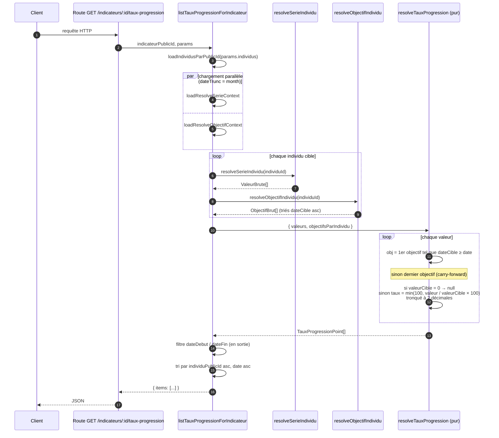
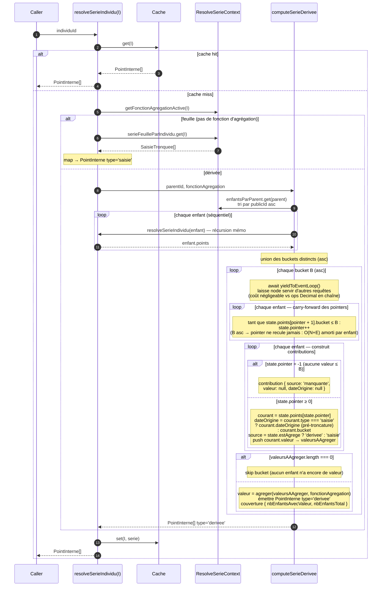

# Taux de progression — Specs et plan d'implémentation

## Contexte

Un indicateur peut être associé à des objectifs temporels par individu (`ObjectifIndicateurIndividu`). Cette feature expose un taux de progression calculé comme :

```
tauxProgression = min(100, (valeur / valeurCible) × 100)
```

où `valeurCible` est celle de l'objectif applicable au bucket mensuel de chaque valeur d'avancement.

**Périmètre :**
- Indicateurs feuille **et** dérivés (agrégation hiérarchique des valeurs via `resolveSerieIndividu`)
- Objectifs feuille **et** dérivés (agrégation hiérarchique via `resolveObjectifIndividu`)
- Granularité paramétrable des deux côtés via `dateTruncValeur` et `dateTruncObjectif` (défaut `month` / `month`), avec la contrainte `dateTruncObjectif >= dateTruncValeur`
- Taux tronqué à 2 décimales (jamais 100 % avant atteinte stricte de la cible)

---

## Règle métier — Objectif applicable

Au bucket D d'une valeur résolue sur un individu I (granularité = `dateTruncValeur`) :

> L'objectif applicable est le **premier objectif (bucketisé selon `dateTruncObjectif`) de I dont `dateCible ≥ D`**.
> Si D est strictement supérieure à toutes les `dateCible` connues → **dernier objectif** (le plus grand `dateCible`).
> Si I n'a aucun objectif applicable (ni direct ni dérivé) → ce point est **exclu** de la réponse.

Le `≥` (et non `>`) est volontaire : sans cette inclusivité, une valeur et un objectif tombant dans le **même bucket** (ex. valeur du 15 décembre et objectif du 31 décembre, tous deux bucketisés à `2024-12-01`) feraient sauter à l'objectif suivant et fausseraient `tauxProgression` pour tout le bucket de l'échéance.

### Exemple

| Objectif | valeurCible | dateCible  |
|----------|-------------|------------|
| 1        | 10          | 2024-01-01 |
| 2        | 50          | 2025-01-01 |
| 3        | 60          | 2025-06-01 |
| 4        | 100         | 2026-02-01 |

| Date de la valeur            | Objectif applicable | valeurCible |
|------------------------------|---------------------|-------------|
| D ≤ 2024-01-01               | Objectif 1          | 10          |
| 2024-01-01 < D ≤ 2025-01-01  | Objectif 2          | 50          |
| 2025-01-01 < D ≤ 2025-06-01  | Objectif 3          | 60          |
| 2025-06-01 < D ≤ 2026-02-01  | Objectif 4          | 100         |
| D > 2026-02-01               | Objectif 4          | 100         |

### Cas limites

| Situation | Comportement |
|-----------|-------------|
| `valeurCible = 0` | `tauxProgression = null` |
| `valeur > valeurCible` | Plafonné à `100` |
| Individu sans aucun objectif | Exclu des `items` |

---

## API

### Endpoint

```
GET /indicateurs/:id/taux-progression
```

### Query params

| Param               | Type              | Requis | Défaut  | Description |
|---------------------|-------------------|--------|---------|-------------|
| `individus`         | CSV publicId      | Oui    | —       | 1..N individus (même convention que `/valeurs`) |
| `dateDebut`         | `YYYY-MM-DD`      | Non    | —       | Filtre inclusif sur le bucket de chaque point |
| `dateFin`           | `YYYY-MM-DD`      | Non    | —       | Filtre inclusif sur le bucket de chaque point |
| `dateTruncValeur`   | `day` / `week` / `month` / `quarter` / `year` | Non | `month` | Granularité de bucket des valeurs |
| `dateTruncObjectif` | `day` / `week` / `month` / `quarter` / `year` | Non | `month` | Granularité de bucket des objectifs. Doit être >= `dateTruncValeur` |

Les filtres `dateDebut`/`dateFin` sont appliqués **en sortie** pour ne pas perturber le carry-forward des séries dérivées.

**Cas d'usage typique** : `dateTruncValeur=month` + `dateTruncObjectif=year` pour suivre l'évolution mensuelle des valeurs contre un objectif annuel.

### Response

**`TauxProgressionListApiModel`** :

```typescript
{
  items: Array<{
    indicateur: string       // publicId de l'indicateur
    individu: string         // publicId de l'individu
    date: string             // bucket mensuel (YYYY-MM-01) de la valeur résolue
    valeur: number           // valeur d'avancement (saisie directe ou agrégée)
    valeurCible: number      // valeurCible de l'objectif applicable (saisie ou agrégée)
    dateCible: string        // bucket mensuel de la dateCible de l'objectif applicable
    tauxProgression: number | null  // min(100, valeur/valeurCible×100), null si valeurCible=0
  }>
}
```

`valeurCible` et `dateCible` sont exposés pour permettre au client de tracer la ligne d'objectif sur un graphique futur et de savoir quand l'objectif change.

**Tri** : par `individu` (publicId asc) puis par `date` asc.

---

## Algorithme de résolution (backend)

L'implémentation suit le pattern établi : **chargement bulk en amont, résolution pure sans I/O**.

```
1. Charger en bulk le ResolveSerieContext (sous-arbre + saisies bucketisées + fonctions d'agrégation)
2. Charger en bulk le ResolveObjectifContext (sous-arbre + objectifs bucketisés)
3. Pour chaque individu cible :
   a. serie    = resolveSerieIndividu(individuId, ...)    → Array<PointInterne>
   b. objectifsMap = resolveObjectifIndividu(individuId, ...) → Map<bucketDateCible, PointObjectifInterne>
4. Convertir objectifsMap → ObjectifBrut[] triés par dateCible ASC
5. Pour chaque (individu, point de série) — `date = point.bucket` :
   a. Si l'individu n'a aucun objectif (ni direct ni dérivé) → exclure
   b. Trouver l'objectif applicable :
      - Premier objectif avec dateCible ≥ date
      - Si aucun (D > tous les dateCible) → dernier objectif
   c. Si valeurCible = 0 → tauxProgression = null
      Sinon → tauxProgression = Math.min(100, (valeur / valeurCible) × 100)
6. Appliquer les filtres dateDebut / dateFin **en sortie** (pas en DB)
7. Trier par individu publicId asc, puis date asc
```

`resolveTauxProgression(valeurs, objectifsParIndividu)` reste pur et n'est jamais conscient
du fait que les valeurs ou les objectifs proviennent d'une saisie directe ou d'une agrégation.
Les deux contextes partagent `dateTrunc='month'` pour aligner les buckets de valeurs et
d'objectifs sur une grille mensuelle commune.

---

## Schéma visuel

### Séquence (ASCII)

```
 Route              Query: listTauxProgressionForIndicateur       Resolvers                 resolveTauxProgression
   │                              │                                   │                              │
   │ GET /indicateurs/:id/taux-progression                            │                              │
   ├─────────────────────────────▶│                                   │                              │
   │                              │ loadIndividusParPublicId          │                              │
   │                              ├──────────────────────────────────▶│                              │
   │                              │                                   │                              │
   │                              │ Promise.all([                                                    │
   │                              │   loadResolveSerieContext({ indicateur, cibles, month })         │
   │                              │   loadResolveObjectifContext({ indicateur, cibles, month })      │
   │                              │ ])                                                               │
   │                              ├──────────────────────────────────▶│                              │
   │                              │                                   │                              │
   │                              │ pour chaque individu cible :      │                              │
   │                              │   resolveSerieIndividu    → ValeurBrute[]                        │
   │                              │   resolveObjectifIndividu → ObjectifBrut[] (triés dateCible asc) │
   │                              ├──────────────────────────────────▶│                              │
   │                              │                                                                  │
   │                              │ resolveTauxProgression({ valeurs, objectifsParIndividu })        │
   │                              ├─────────────────────────────────────────────────────────────────▶│
   │                              │                                                                  │ pour chaque valeur :
   │                              │                                                                  │   obj = 1er objectif avec
   │                              │                                                                  │     dateCible ≥ date
   │                              │                                                                  │   sinon dernier objectif
   │                              │                                                                  │     (carry-forward)
   │                              │                                                                  │   si valeurCible = 0 → null
   │                              │                                                                  │   sinon taux = min(100,
   │                              │                                                                  │     valeur / cible × 100)
   │                              │                                                                  │   tronqué à 2 décimales
   │                              │◀────────────────────────────────────────────  TauxProgressionPoint[]
   │                              │                                                                  │
   │                              │ filtre dateDebut / dateFin (en sortie)                           │
   │                              │ tri par individuPublicId asc, date asc                           │
   │◀──── { items: TauxProgressionPointApiModel[] }                                                  │
```

### Règle de matching — vue timeline

Pour un individu donné, les objectifs bucketisés sont triés `dateCible` ASC. Chaque valeur cherche le **premier objectif dont `dateCible ≥ bucket de la valeur`**. Si la valeur est postérieure à toutes les `dateCible`, on retient le **dernier objectif** (carry-forward).

```
objectifs  :         ▼ 2024-06          ▼ 2025-06              ▼ 2026-06
                     cible = 10         cible = 50             cible = 100
                     │                  │                      │
─────────●───────────┼───────●──────────┼──────●───────────────┼──────●────▶ temps
        2024-03              2024-08          2025-03                 2026-08
          │                    │                │                       │
          ▼                    ▼                ▼                       ▼
      obj 2024-06          obj 2025-06      obj 2025-06             obj 2026-06
      cible=10             cible=50         cible=50                cible=100
                                                                    (dernier, carry)
```

### Version Mermaid (copier-coller dans un viewer)



### `resolveSerieIndividu` — récursion + carry-forward **permissif**

Calcule la série d'un individu :
- si l'individu est **feuille** (pas de fonction d'agrégation active sur son référentiel) → ses saisies bucketisées telles quelles
- sinon → série dérivée par `combineLatest` permissif sur ses enfants directs (récursion + mémoïsation via `cache`)

> **Permissif** : un bucket sort dès qu'**au moins un enfant** a une valeur portée. Les autres figurent en `manquante` dans `contributions`, avec une `couverture { nbEnfantsAvecValeur, nbEnfantsTotal }`.

#### Flux (ASCII)

```
resolveSerieIndividu(individuId, ctx, cache)               [async — yield event loop par bucket]
   │
   ├── cache.get(individuId) → hit ? oui → retour
   │
   ├── fonctionAgregation = getFonctionAgregationActive(individuId, ctx)
   │
   ├── feuille (fonctionAgregation === null) ?
   │     │
   │     ├─ OUI → computeSerieSaisie
   │     │         ctx.serieFeuilleParIndividu.get(individuId)
   │     │           → PointInterne[] type='saisie' (bucket, dateOrigine, valeur)
   │     │
   │     └─ NON → computeSerieDerivee(parent, fonctionAgregation)
   │                │
   │                ├── enfants = ctx.enfantsParParent.get(parent), triés par publicId asc
   │                │
   │                ├── pour chaque enfant (séquentiel — la mémo amortit le coût) :
   │                │     state.points = await resolveSerieIndividu(enfant.id, ctx, cache)
   │                │     state.pointer = -1
   │                │
   │                ├── union des buckets distincts présents chez ≥ 1 enfant (triés ASC)
   │                │
   │                └── pour chaque bucket B (ASC) :
   │                      await yieldToEventLoop()
   │                      ├── carry-forward : pour chaque enfant, avancer pointer tant que
   │                      │     state.points[pointer + 1].bucket ≤ B
   │                      ├── construire contributions :
   │                      │     - pointer ≥ 0 → 'saisie' ou 'derivee' (selon estAgrege)
   │                      │     - pointer = -1 → 'manquante' (valeur=null)
   │                      └── si AU MOINS UN enfant a une valeur :
   │                            valeur = agreger(valeurs, fonctionAgregation)
   │                            émettre PointInterne type='derivee'
   │                              avec couverture { avec, total }
   │                          sinon → skip ce bucket
   │
   └── cache.set(individuId, serie) ; retour
```

#### Mini exemple (somme, 2 enfants feuilles)

```
Enfant A (saisies)  :   ●(10) ───────────── ●(20)
                     2024-01              2024-06
Enfant B (saisies)  :       ●(5) ──────────────── ●(15)
                          2024-03                2024-08

Union buckets ASC : 2024-01   2024-03   2024-06   2024-08

bucket    ptr A → val    ptr B → val    contributions               valeur émise    couverture
─────────────────────────────────────────────────────────────────────────────────────────────
2024-01   ●(10)           — (ptr=-1)    [A=10, B=manquante]              10            1/2
2024-03   ●(10) (carry)   ●(5)           [A=10, B=5]                      15            2/2
2024-06   ●(20)           ●(5)  (carry)  [A=20, B=5]                      25            2/2
2024-08   ●(20) (carry)   ●(15)          [A=20, B=15]                     35            2/2

→ permissif : 2024-01 sort à couverture 1/2 dès que A a une valeur.
```

#### Mermaid



### `resolveObjectifIndividu` — récursion + carry-forward **strict**

Calcule les objectifs bucketisés d'un individu :
- si l'individu est **feuille** → ses saisies d'objectif déjà bucketisées
- sinon → carry-forward strict sur les enfants directs (récursion + mémoïsation)

> **Strict** : un bucket n'est émis **que si TOUS les enfants** ont au moins une valeur portée (`pointer ≥ 0`). Tant qu'un seul enfant n'a encore aucun objectif connu, le bucket est ignoré. La structure de sortie est une `Map<BucketKey, PointObjectifInterne>` (lookup O(1) côté `tauxProgression`).

#### Flux (ASCII)

```
resolveObjectifIndividu(individuId, ctx, cache)            [synchrone]
   │
   ├── cache.get(individuId) → hit ? oui → retour
   │
   ├── fonctionAgregation = getFonctionAgregationActive(individuId, ctx)
   │
   ├── feuille (fonctionAgregation === null) ?
   │     │
   │     ├─ OUI → buildSaisieMap
   │     │         ctx.objectifBucketParIndividu.get(individuId)
   │     │           → Map<BucketKey, PointObjectifInterne type='saisie' (bucket, valeur)>
   │     │
   │     └─ NON → computeObjectifDerive(parent, fonctionAgregation)
   │                │
   │                ├── enfants = ctx.enfantsParParent.get(parent), triés par publicId asc
   │                │
   │                ├── pour chaque enfant (récursion synchrone, mémoïsée) :
   │                │     state.values  = resolveObjectifIndividu(enfant.id, ctx, cache)
   │                │     state.buckets = [...values.values()].map(p => p.bucket).sort(asc)
   │                │     state.pointer = -1
   │                │
   │                ├── union des buckets distincts (triés ASC)
   │                │
   │                └── pour chaque bucket B (ASC) :
   │                      ├── carry-forward : pour chaque enfant, avancer pointer tant que
   │                      │     state.buckets[pointer + 1] ≤ B
   │                      ├── allHaveValue = true
   │                      │   pour chaque enfant :
   │                      │     si pointer < 0 → allHaveValue = false ; BREAK
   │                      │     sinon → push contribution + valeur
   │                      └── si allHaveValue && valeurs.length > 0 :
   │                            result.set(B, type='derivee', agreger(valeurs, fonctionAgregation))
   │                          sinon → skip ce bucket
   │
   └── cache.set(individuId, result) ; retour Map<BucketKey, PointObjectifInterne>
```

#### Mini exemple (somme, 2 enfants feuilles — mêmes saisies que ci-dessus)

```
Enfant A (objectifs)  :   ▼(10) ───────────── ▼(20)
                       2024-01              2024-06
Enfant B (objectifs)  :       ▼(5) ──────────────── ▼(15)
                            2024-03                2024-08

Union buckets ASC : 2024-01   2024-03   2024-06   2024-08

bucket    ptr A → val    ptr B → val    allHave ?    sortie agrégée ?
──────────────────────────────────────────────────────────────────────────
2024-01   ▼(10)           — (ptr=-1)    NON          SKIP (B pas encore d'objectif)
2024-03   ▼(10) (carry)   ▼(5)           OUI         somme = 15
2024-06   ▼(20)           ▼(5)  (carry)  OUI         somme = 25
2024-08   ▼(20) (carry)   ▼(15)          OUI         somme = 35

→ strict : 2024-01 sauté (vs émis en permissif sur les séries).
```

Conséquence côté `resolveTauxProgression` : tant qu'un parent n'a pas d'objectif consolidé sur un bucket, ce bucket ne fait jamais partie de `ObjectifBrut[]` pour cet individu et ne biaise donc pas la recherche `findObjectifApplicable`.

#### Mermaid

```mermaid
sequenceDiagram
    autonumber
    participant Caller
    participant R as resolveObjectifIndividu(I)
    participant Cache
    participant Ctx as ResolveObjectifContext
    participant COD as computeObjectifDerive

    Caller->>R: individuId
    R->>Cache: get(I)
    alt cache hit
        Cache-->>R: Map<BucketKey, PointObjectifInterne>
        R-->>Caller: Map
    else cache miss
        R->>Ctx: getFonctionAgregationActive(I)
        alt feuille (pas de fonction d'agrégation)
            R->>Ctx: objectifBucketParIndividu.get(I)
            Ctx-->>R: Map<BucketKey, ObjectifSaisieBucketise>
            Note over R: map → Map<BucketKey, PointObjectifInterne type='saisie'>
        else dérivée
            R->>COD: parentId, fonctionAgregation
            COD->>Ctx: enfantsParParent.get(parent)<br/>tri par publicId asc
            loop chaque enfant (récursion synchrone)
                COD->>R: resolveObjectifIndividu(enfant) — mémo
                R-->>COD: enfant.values (Map) + buckets triés asc
            end
            Note over COD: union des buckets distincts (asc)
            loop chaque bucket B (asc)
                loop chaque enfant — carry-forward des pointers
                    Note over COD: tant que state.buckets[pointer + 1] ≤ B :<br/>  state.pointer++<br/>(B asc → pointer ne recule jamais : O(N+E) amorti par enfant)<br/>note : pas de yieldToEventLoop (calcul synchrone)
                end
                Note over COD: allHaveValue = true ; valeurs = []
                loop chaque enfant — collecte stricte
                    alt state.pointer = -1
                        Note over COD: allHaveValue = false<br/>BREAK la boucle (inutile de continuer)
                    else state.pointer ≥ 0
                        Note over COD: dateCible = state.buckets[state.pointer]<br/>point = state.values.get(formatBucket(dateCible))<br/>contribution { valeur, dateCible,<br/>  estAgregee: point.type === 'derivee' }<br/>push point.valeur → valeurs
                    end
                end
                alt !allHaveValue OR valeurs.length === 0
                    Note over COD: SKIP bucket<br/>(au moins un enfant n'a aucun objectif ≤ B)
                else
                    Note over COD: valeur = agreger(valeurs, fonctionAgregation)<br/>result.set(formatBucket(B),<br/>  { type: 'derivee', bucket: B, valeur,<br/>    fonctionAgregation, contributions })
                end
            end
            COD-->>R: Map<BucketKey, PointObjectifInterne>
        end
        R->>Cache: set(I, result)
        R-->>Caller: Map
    end
```

---

## Plan d'implémentation

### Étape 1 — Schema partagé (`mb-shared`)

**Fichier** : `packages/mb-shared/src/tauxProgression.ts` (nouveau)

- Définir `tauxProgressionPointApiModelSchema` (un point de la série)
- Définir `tauxProgressionListApiModelSchema` (`{ items: [...] }`)
- Définir `listTauxProgressionQuerySchema` (`individus`, `dateDebut`, `dateFin`)
- Exporter les types inférés

### Étape 2 — Query de chargement (`mb-api`)

**Fichier** : `apps/mb-api/src/tauxProgression/queries/listTauxProgressionForIndicateur.ts` (nouveau)

- Charger les `ValeurAvancement` en bulk (réutiliser ou s'inspirer de `getValeursForIndicateur`)
- Charger les `ObjectifIndicateurIndividu` en bulk (réutiliser ou s'inspirer de `listObjectifsForIndicateur`)

### Étape 3 — Résolution pure (`mb-api`)

**Fichier** : `apps/mb-api/src/tauxProgression/resolveTauxProgression.ts` (nouveau)

- Fonction pure `resolveTauxProgression(valeurs, objectifsParIndividu)` → `TauxProgressionPoint[]`
- Implémenter la recherche d'objectif applicable (`findObjectifApplicable`)
- Implémenter le calcul du taux avec cap à 100 et gestion de la division par zéro
- Couvrir par des tests unitaires

### Étape 4 — Route (`mb-api`)

**Fichier** : `apps/mb-api/src/tauxProgression/routes.ts` (nouveau)

- `GET /indicateurs/{id}/taux-progression`
- Validation Zod des query params via `listTauxProgressionQuerySchema`
- Vérification des permissions sur l'indicateur (réutiliser `requireIndicateurReadPermission`)
- Appel query + résolution + retour JSON

**Fichier** : `apps/mb-api/src/app.ts` — enregistrer la nouvelle route

### Étape 5 — Frontend : query (`mb-webapp`)

**Fichier** : `apps/mb-webapp/src/api/indicateurs.ts`

- Ajouter `fetchTauxProgressionForIndicateur(indicateurId, params)`

**Fichier** : `apps/mb-webapp/src/queries/indicateurs.ts`

- Ajouter `indicateurTauxProgressionQueryOptions(indicateurId, individuId)`
- Ajouter au `prefetchIndicateurValeursForIndividu`

### Étape 6 — Frontend : affichage (`mb-webapp`)

**Fichier** : `apps/mb-webapp/src/components/indicateurs/IndicateurStatsPanel.tsx`

- Consommer `indicateurTauxProgressionQueryOptions`
- Afficher le **dernier taux de progression** dans une `StatCard`
- Format : `"87 %"` (entier arrondi, suffixe %)
- Si aucun point retourné (individu sans objectif) → ne pas afficher la StatCard

---

## Hors scope

- Exposition des `contributions` d'agrégation dans la réponse (cf. `/valeurs` qui le fait déjà ; pas l'objet de cet endpoint)
- Granularités hétérogènes côté valeurs entre individus de la même requête (un seul `dateTruncValeur` s'applique à tous)
