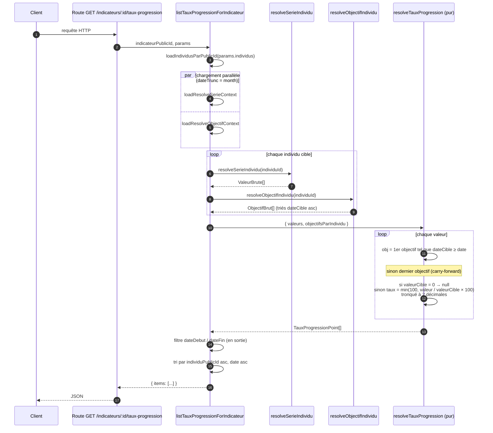

# Taux de progression — Specs et plan d'implémentation

## Contexte

Un indicateur peut être associé à des objectifs temporels par individu (`ObjectifIndicateurIndividu`). Cette feature expose un taux de progression calculé comme :

```
tauxProgression = min(100, (valeur / valeurCible) × 100)
```

où `valeurCible` est celle de l'objectif applicable au bucket mensuel de chaque valeur d'avancement.

**Périmètre :**
- Indicateurs feuille **et** dérivés (agrégation hiérarchique des valeurs via `resolveSerieIndividu`)
- Objectifs feuille **et** dérivés (agrégation hiérarchique via `resolveObjectifIndividu`)
- Granularité paramétrable des deux côtés via `dateTruncValeur` et `dateTruncObjectif` (défaut `month` / `month`), avec la contrainte `dateTruncObjectif >= dateTruncValeur`
- Taux tronqué à 2 décimales (jamais 100 % avant atteinte stricte de la cible)

---

## Règle métier — Objectif applicable

Au bucket D d'une valeur résolue sur un individu I (granularité = `dateTruncValeur`) :

> L'objectif applicable est le **premier objectif (bucketisé selon `dateTruncObjectif`) de I dont `dateCible ≥ D`**.
> Si D est strictement supérieure à toutes les `dateCible` connues → **dernier objectif** (le plus grand `dateCible`).
> Si I n'a aucun objectif applicable (ni direct ni dérivé) → ce point est **exclu** de la réponse.

Le `≥` (et non `>`) est volontaire : sans cette inclusivité, une valeur et un objectif tombant dans le **même bucket** (ex. valeur du 15 décembre et objectif du 31 décembre, tous deux bucketisés à `2024-12-01`) feraient sauter à l'objectif suivant et fausseraient `tauxProgression` pour tout le bucket de l'échéance.

### Exemple

| Objectif | valeurCible | dateCible  |
|----------|-------------|------------|
| 1        | 10          | 2024-01-01 |
| 2        | 50          | 2025-01-01 |
| 3        | 60          | 2025-06-01 |
| 4        | 100         | 2026-02-01 |

| Date de la valeur       | Objectif applicable | valeurCible |
|-------------------------|---------------------|-------------|
| D < 2024-01-01          | Objectif 1          | 10          |
| 2024-01-01 ≤ D < 2025-01-01 | Objectif 2     | 50          |
| 2025-01-01 ≤ D < 2025-06-01 | Objectif 3     | 60          |
| 2025-06-01 ≤ D < 2026-02-01 | Objectif 4     | 100         |
| D ≥ 2026-02-01          | Objectif 4          | 100         |

### Cas limites

| Situation | Comportement |
|-----------|-------------|
| `valeurCible = 0` | `tauxProgression = null` |
| `valeur > valeurCible` | Plafonné à `100` |
| Individu sans aucun objectif | Exclu des `items` |

---

## API

### Endpoint

```
GET /indicateurs/:id/taux-progression
```

### Query params

| Param               | Type              | Requis | Défaut  | Description |
|---------------------|-------------------|--------|---------|-------------|
| `individus`         | CSV publicId      | Oui    | —       | 1..N individus (même convention que `/valeurs`) |
| `dateDebut`         | `YYYY-MM-DD`      | Non    | —       | Filtre inclusif sur le bucket de chaque point |
| `dateFin`           | `YYYY-MM-DD`      | Non    | —       | Filtre inclusif sur le bucket de chaque point |
| `dateTruncValeur`   | `day` / `week` / `month` / `quarter` / `year` | Non | `month` | Granularité de bucket des valeurs |
| `dateTruncObjectif` | `day` / `week` / `month` / `quarter` / `year` | Non | `month` | Granularité de bucket des objectifs. Doit être >= `dateTruncValeur` |

Les filtres `dateDebut`/`dateFin` sont appliqués **en sortie** pour ne pas perturber le carry-forward des séries dérivées.

**Cas d'usage typique** : `dateTruncValeur=month` + `dateTruncObjectif=year` pour suivre l'évolution mensuelle des valeurs contre un objectif annuel.

### Response

**`TauxProgressionListApiModel`** :

```typescript
{
  items: Array<{
    indicateur: string       // publicId de l'indicateur
    individu: string         // publicId de l'individu
    date: string             // bucket mensuel (YYYY-MM-01) de la valeur résolue
    valeur: number           // valeur d'avancement (saisie directe ou agrégée)
    valeurCible: number      // valeurCible de l'objectif applicable (saisie ou agrégée)
    dateCible: string        // bucket mensuel de la dateCible de l'objectif applicable
    tauxProgression: number | null  // min(100, valeur/valeurCible×100), null si valeurCible=0
  }>
}
```

`valeurCible` et `dateCible` sont exposés pour permettre au client de tracer la ligne d'objectif sur un graphique futur et de savoir quand l'objectif change.

**Tri** : par `individu` (publicId asc) puis par `date` asc.

---

## Algorithme de résolution (backend)

L'implémentation suit le pattern établi : **chargement bulk en amont, résolution pure sans I/O**.

```
1. Charger en bulk le ResolveSerieContext (sous-arbre + saisies bucketisées + fonctions d'agrégation)
2. Charger en bulk le ResolveObjectifContext (sous-arbre + objectifs bucketisés)
3. Pour chaque individu cible :
   a. serie    = resolveSerieIndividu(individuId, ...)    → Array<PointInterne>
   b. objectifsMap = resolveObjectifIndividu(individuId, ...) → Map<bucketDateCible, PointObjectifInterne>
4. Convertir objectifsMap → ObjectifBrut[] triés par dateCible ASC
5. Pour chaque (individu, point de série) — `date = point.bucket` :
   a. Si l'individu n'a aucun objectif (ni direct ni dérivé) → exclure
   b. Trouver l'objectif applicable :
      - Premier objectif avec dateCible ≥ date
      - Si aucun (D ≥ tous les dateCible) → dernier objectif
   c. Si valeurCible = 0 → tauxProgression = null
      Sinon → tauxProgression = Math.min(100, (valeur / valeurCible) × 100)
6. Appliquer les filtres dateDebut / dateFin **en sortie** (pas en DB)
7. Trier par individu publicId asc, puis date asc
```

`resolveTauxProgression(valeurs, objectifsParIndividu)` reste pur et n'est jamais conscient
du fait que les valeurs ou les objectifs proviennent d'une saisie directe ou d'une agrégation.
Les deux contextes partagent `dateTrunc='month'` pour aligner les buckets de valeurs et
d'objectifs sur une grille mensuelle commune.

---

## Schéma visuel

### Séquence (ASCII)

```
 Route              Query: listTauxProgressionForIndicateur       Resolvers                 resolveTauxProgression
   │                              │                                   │                              │
   │ GET /indicateurs/:id/taux-progression                            │                              │
   ├─────────────────────────────▶│                                   │                              │
   │                              │ loadIndividusParPublicId          │                              │
   │                              ├──────────────────────────────────▶│                              │
   │                              │                                   │                              │
   │                              │ Promise.all([                                                    │
   │                              │   loadResolveSerieContext({ indicateur, cibles, month })         │
   │                              │   loadResolveObjectifContext({ indicateur, cibles, month })      │
   │                              │ ])                                                               │
   │                              ├──────────────────────────────────▶│                              │
   │                              │                                   │                              │
   │                              │ pour chaque individu cible :      │                              │
   │                              │   resolveSerieIndividu    → ValeurBrute[]                        │
   │                              │   resolveObjectifIndividu → ObjectifBrut[] (triés dateCible asc) │
   │                              ├──────────────────────────────────▶│                              │
   │                              │                                                                  │
   │                              │ resolveTauxProgression({ valeurs, objectifsParIndividu })        │
   │                              ├─────────────────────────────────────────────────────────────────▶│
   │                              │                                                                  │ pour chaque valeur :
   │                              │                                                                  │   obj = 1er objectif avec
   │                              │                                                                  │     dateCible ≥ date
   │                              │                                                                  │   sinon dernier objectif
   │                              │                                                                  │     (carry-forward)
   │                              │                                                                  │   si valeurCible = 0 → null
   │                              │                                                                  │   sinon taux = min(100,
   │                              │                                                                  │     valeur / cible × 100)
   │                              │                                                                  │   tronqué à 2 décimales
   │                              │◀────────────────────────────────────────────  TauxProgressionPoint[]
   │                              │                                                                  │
   │                              │ filtre dateDebut / dateFin (en sortie)                           │
   │                              │ tri par individuPublicId asc, date asc                           │
   │◀──── { items: TauxProgressionPointApiModel[] }                                                  │
```

### Règle de matching — vue timeline

Pour un individu donné, les objectifs bucketisés sont triés `dateCible` ASC. Chaque valeur cherche le **premier objectif dont `dateCible ≥ bucket de la valeur`**. Si la valeur est postérieure à toutes les `dateCible`, on retient le **dernier objectif** (carry-forward).

```
objectifs  :         ▼ 2024-06          ▼ 2025-06              ▼ 2026-06
                     cible = 10         cible = 50             cible = 100
                     │                  │                      │
─────────●───────────┼───────●──────────┼──────●───────────────┼──────●────▶ temps
        2024-03              2024-08          2025-03                 2026-08
          │                    │                │                       │
          ▼                    ▼                ▼                       ▼
      obj 2024-06          obj 2025-06      obj 2025-06             obj 2026-06
      cible=10             cible=50         cible=50                cible=100
                                                                    (dernier, carry)
```

### Version Mermaid (copier-coller dans un viewer)



---

## Plan d'implémentation

### Étape 1 — Schema partagé (`mb-shared`)

**Fichier** : `packages/mb-shared/src/tauxProgression.ts` (nouveau)

- Définir `tauxProgressionPointApiModelSchema` (un point de la série)
- Définir `tauxProgressionListApiModelSchema` (`{ items: [...] }`)
- Définir `listTauxProgressionQuerySchema` (`individus`, `dateDebut`, `dateFin`)
- Exporter les types inférés

### Étape 2 — Query de chargement (`mb-api`)

**Fichier** : `apps/mb-api/src/tauxProgression/queries/listTauxProgressionForIndicateur.ts` (nouveau)

- Charger les `ValeurAvancement` en bulk (réutiliser ou s'inspirer de `getValeursForIndicateur`)
- Charger les `ObjectifIndicateurIndividu` en bulk (réutiliser ou s'inspirer de `listObjectifsForIndicateur`)

### Étape 3 — Résolution pure (`mb-api`)

**Fichier** : `apps/mb-api/src/tauxProgression/resolveTauxProgression.ts` (nouveau)

- Fonction pure `resolveTauxProgression(valeurs, objectifsParIndividu)` → `TauxProgressionPoint[]`
- Implémenter la recherche d'objectif applicable (`findObjectifApplicable`)
- Implémenter le calcul du taux avec cap à 100 et gestion de la division par zéro
- Couvrir par des tests unitaires

### Étape 4 — Route (`mb-api`)

**Fichier** : `apps/mb-api/src/tauxProgression/routes.ts` (nouveau)

- `GET /indicateurs/{id}/taux-progression`
- Validation Zod des query params via `listTauxProgressionQuerySchema`
- Vérification des permissions sur l'indicateur (réutiliser `requireIndicateurReadPermission`)
- Appel query + résolution + retour JSON

**Fichier** : `apps/mb-api/src/app.ts` — enregistrer la nouvelle route

### Étape 5 — Frontend : query (`mb-webapp`)

**Fichier** : `apps/mb-webapp/src/api/indicateurs.ts`

- Ajouter `fetchTauxProgressionForIndicateur(indicateurId, params)`

**Fichier** : `apps/mb-webapp/src/queries/indicateurs.ts`

- Ajouter `indicateurTauxProgressionQueryOptions(indicateurId, individuId)`
- Ajouter au `prefetchIndicateurValeursForIndividu`

### Étape 6 — Frontend : affichage (`mb-webapp`)

**Fichier** : `apps/mb-webapp/src/components/indicateurs/IndicateurStatsPanel.tsx`

- Consommer `indicateurTauxProgressionQueryOptions`
- Afficher le **dernier taux de progression** dans une `StatCard`
- Format : `"87 %"` (entier arrondi, suffixe %)
- Si aucun point retourné (individu sans objectif) → ne pas afficher la StatCard

---

## Hors scope

- Exposition des `contributions` d'agrégation dans la réponse (cf. `/valeurs` qui le fait déjà ; pas l'objet de cet endpoint)
- Granularités hétérogènes côté valeurs entre individus de la même requête (un seul `dateTruncValeur` s'applique à tous)
