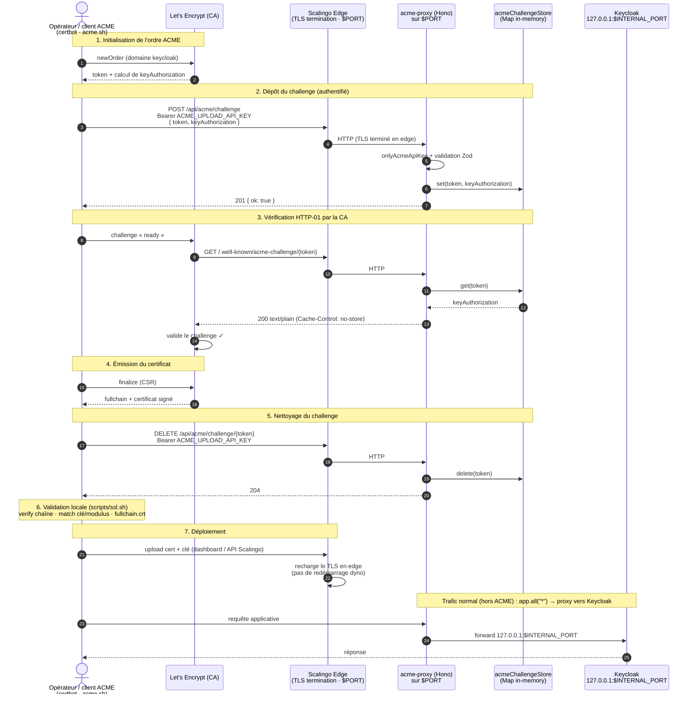

# Renouvellement SSL / TLS (ACME HTTP-01)

Cette doc décrit comment on renouvelle le certificat TLS de l'application
Keycloak déployée sur Scalingo (`dev-keycloak-ditp.osc-fr1.scalingo.io`).

## Pourquoi un proxy ACME ?

La validation ACME **HTTP-01** oblige à servir un fichier à l'URL
`/.well-known/acme-challenge/{token}` : la CA (Let's Encrypt) vient le lire pour
prouver qu'on contrôle bien le domaine. **Keycloak ne sait pas servir ces
fichiers.**

On place donc un petit **acme-proxy** (Hono/Node) devant Keycloak, dans le même
dyno Scalingo. Le dyno n'expose qu'**un seul port public** (`$PORT`, imposé par
Scalingo) : c'est le proxy qui l'occupe. Il intercepte les requêtes ACME et
forward **tout le reste** vers Keycloak (`127.0.0.1:$INTERNAL_PORT`).

```
Internet ──$PORT──► acme-proxy (Hono) ──127.0.0.1:$INTERNAL_PORT──► Keycloak
```

Les deux process sont démarrés et couplés par
[`scripts/start.sh`](../scripts/start.sh) (via le `Procfile`) : si l'un meurt,
l'autre est tué et le script sort en non-zéro pour que Scalingo redémarre le
dyno — pas de proxy orphelin qui répond des 502.

## Acteurs

| Acteur | Rôle |
| --- | --- |
| **Opérateur / client ACME** (`certbot`, `acme.sh`) | Externe au repo, pilote le renouvellement. |
| **Let's Encrypt (CA)** | Émet le certificat, vérifie le challenge HTTP-01. |
| **Scalingo Edge** | Termine le TLS (`KC_PROXY=edge`), route le trafic HTTP vers le dyno sur `$PORT`. |
| **acme-proxy** ([`acme-proxy/app.ts`](../acme-proxy/app.ts)) | Sert / stocke / supprime les challenges, proxy le reste vers Keycloak. |
| **acmeChallengeStore** ([`acme-proxy/acmeChallengeStore.ts`](../acme-proxy/acmeChallengeStore.ts)) | `Map` in-memory `token → keyAuthorization`. **Non persistant.** |
| **Keycloak** | Le serveur applicatif, derrière le proxy. |

## Le flow



## Détail des endpoints du proxy

Définis dans [`acme-proxy/app.ts`](../acme-proxy/app.ts) :

| Méthode & route | Auth | Effet |
| --- | --- | --- |
| `POST /api/acme/challenge` | Bearer `ACME_UPLOAD_API_KEY` | `store.set(token, keyAuthorization)` → `201` |
| `GET /.well-known/acme-challenge/:token` | **Public** (lu par la CA) | Renvoie la `keyAuthorization` en `text/plain`, ou `404` |
| `DELETE /api/acme/challenge/:token` | Bearer `ACME_UPLOAD_API_KEY` | `store.delete(token)` → `204` |
| `* (tout le reste)` | — | Proxy vers `http://127.0.0.1:$INTERNAL_PORT` (Keycloak) |

L'authentification est gérée par
[`onlyAcmeApiKey`](../acme-proxy/onlyAcmeApiKey.ts) : `503` si
`ACME_UPLOAD_API_KEY` n'est pas configurée, `401` si le header `Authorization`
est absent/mal formé, `403` si la clé ne correspond pas.

## Validation locale avant déploiement (`scripts/ssl.sh`)

Une fois le certificat récupéré, on le valide avec
[`scripts/ssl.sh`](../../../scripts/ssl.sh) (à la racine du repo) avant de
l'uploader sur Scalingo :

```bash
./scripts/ssl.sh leaf.crt intermediate.crt private.key
```

Le script :

1. vérifie que le **leaf est signé par l'intermédiaire**
   (`openssl verify -untrusted`) ;
2. vérifie que la **clé privée correspond au leaf** (comparaison des modulus) ;
3. génère `fullchain.crt` (`leaf` + `intermediate` concaténés) ;
4. contrôle que le fullchain contient **≥ 2 certificats**.

Puis le certificat + la clé sont uploadés sur Scalingo (dashboard ou API), qui
recharge le TLS en edge **sans redémarrer le dyno**.

## Points d'attention

- **Le store est éphémère.** `acmeChallengeStore` est une simple `Map`
  in-memory : un redémarrage du dyno pendant le renouvellement perd le
  challenge. Il faut redéposer le challenge après tout redémarrage. C'est
  acceptable car le challenge n'a besoin de vivre que quelques minutes (le temps
  que la CA vienne le lire).
- **HTTP-01 passe en HTTP.** Le TLS est terminé par Scalingo Edge
  (`KC_PROXY=edge`) ; le proxy et Keycloak ne voient que du HTTP en interne.
- **Pas d'automatisation dans le repo.** Il n'y a ni `certbot` ni cron
  versionnés : les étapes 1→5 sont exécutées par un client ACME externe, et les
  étapes 6→7 (validation `ssl.sh` + upload) sont manuelles.
- **Variables d'env requises** sur l'app Scalingo : `ACME_UPLOAD_API_KEY` (clé
  partagée avec le client ACME), `PORT` (fourni par Scalingo), `INTERNAL_PORT`
  (défaut `8080`).
