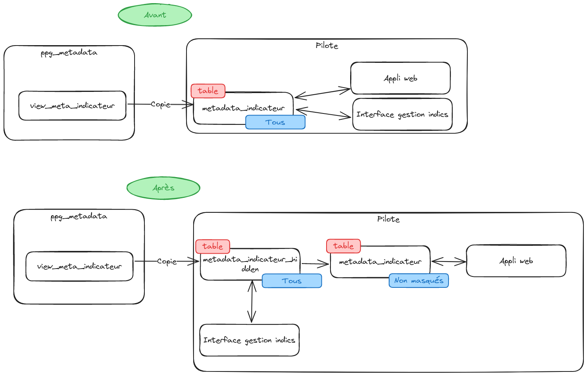

# Masquage des indicateurs

Pour masquer les indicateurs, on crée vie *dbt* une table [`metadata_indicateurs_hidden`](../../data_management/data_factory/models/raw/ppg_metadata/metadata_indicateurs_hidden.py) qui contiendra tous les indicateurs, masqués et non masqués.

On crée ensuite une vue [`metadata_indicateurs`](../../data_management/data_factory/models/raw/ppg_metadata/metadata_indicateurs.sql) qui aura la même structure que `metadata_indicateurs_hidden` mais uniquement avec les indicateurs **non masqués**. Tout le reste de l'application est basé sur cette table, sauf l'interface de gestion des utilisateurs qui doit être en mesure de réactiver des indicateurs masqués.

Ce grahique décrit la logique avant et après cette implémentation. 

Voir [ce diff](https://github.com/DITP-pilotage/pilote-2/compare/5539acf854e4330ee551eadc4435b34620a0252c...8a778bf342d0cbfa699ffec109619ee4bd91a3ee) pour le détail du code.